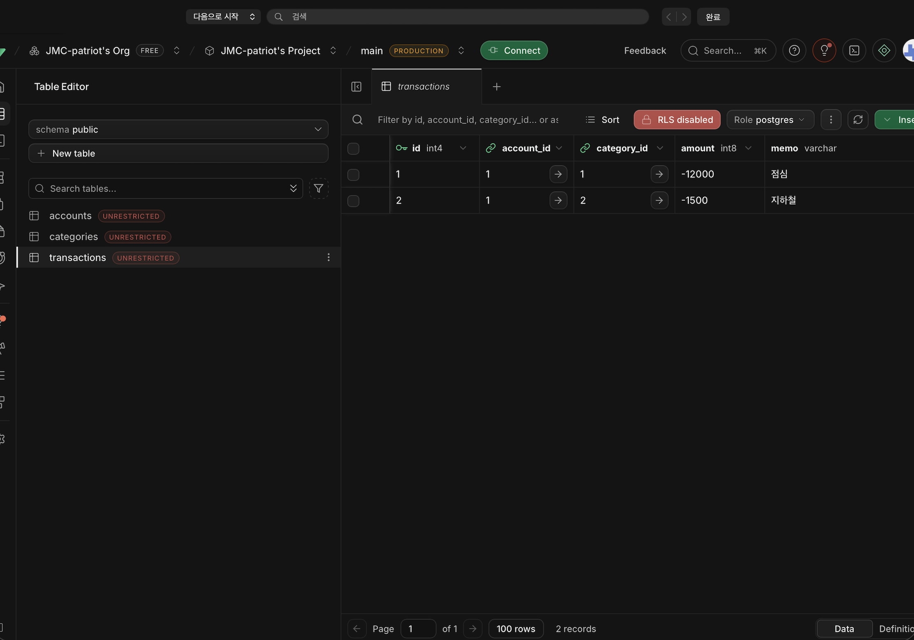

# 가계부 API (ledger-api)

- GitHub: https://github.com/JMC-patriot/ledger-api
- Render: https://ledger-api-aoy5.onrender.com/docs

FastAPI + SQLAlchemy + Supabase(PostgreSQL)로 만든 계좌·거래·카테고리 API임.

## 엔드포인트

| 메서드 | 경로 | 하는 일 |
|---|---|---|
| POST | /accounts | 계좌 생성 |
| GET | /accounts | 계좌 목록 |
| GET | /accounts/{account_id} | 계좌 단건 |
| POST | /transactions | 거래 생성 (계좌 없으면 404) |
| GET | /accounts/{account_id}/detail | 계좌 + 거래 목록(중첩 응답) |
| GET | /stats/by-category | 카테고리별 지출 합계 |

## 실습 기록

### ① 결과 확인
Supabase Table Editor의 `transactions` 테이블에 API로 넣은 거래 2건(점심 -12000, 지하철 -1500)이 저장된 것을 확인함.

### ② 핵심 개념 되새김
- **계좌·거래를 두 테이블로 나눈 이유(1:N 관계)**: 계좌 하나에 거래가 여러 개 붙는 구조이므로, 계좌 정보는 한 번만 저장하고 거래는 `account_id`로 해당 계좌를 가리키게 함. 계좌 이름을 바꿀 때 한 행만 고치면 되고, 외래키 덕분에 존재하지 않는 계좌에 거래가 들어가는 것을 DB가 막아 줌.
- **SQLAlchemy 모델 클래스와 실제 테이블의 대응**: `class Account(Base)` 하나가 `accounts` 테이블 하나이고, `Mapped[...]` 속성 하나가 컬럼 하나임. `Mapped[str]`은 NOT NULL, `Mapped[str | None]`은 NULL 허용이 되며, `create_all()`이 클래스 정의를 보고 CREATE TABLE을 대신 실행함.
- **접속 문자열을 .env로 분리하는 이유**: 연결 문자열에 DB 비밀번호가 포함되어 있어, 코드와 함께 GitHub에 올라가면 누구나 DB에 접속할 수 있게 됨. `.env`로 분리하고 `.gitignore`로 제외하면 비밀번호는 로컬에만 남고, Render에서는 같은 이름의 환경변수로 넣어 코드 수정 없이 배포할 수 있음.

### ③ 자유 로그
- **배운 것**: SQLite로 SQL(JOIN·GROUP BY·트랜잭션)을 먼저 직접 작성해 보니, SQLAlchemy의 `func.sum()`·`group_by()`가 결국 같은 SQL을 생성한다는 점을 이해하였음. 롤백 실습에서 출금 UPDATE가 이미 실행되었는데도 잔액이 그대로인 것을 보고 원자성의 의미를 알게 되었음. 로컬 앱과 Render 앱이 같은 Supabase를 바라보므로 어디서 조회해도 같은 데이터가 나오는 것도 확인하였음.
- **막힌 곳과 푼 과정**
  - 맥 기본 `python3`가 3.9라서 `int | None` 문법이 동작하지 않음 → Python 3.13으로 가상환경을 새로 만들어 해결하였음.
  - Supabase 프로젝트 생성 시 Region이 Seoul이 아닌 Mumbai로 설정됨 → 연결에는 문제가 없어 그대로 사용하였고, 호스트 주소를 `aws-0-ap-south-1`로 맞춤.
  - Table Editor에서 테이블이 보이지 않음 → 브라우저 창이 좁아 왼쪽 목록이 숨겨진 것이었음.
  - Render의 Start Command 칸에 회색 예시 글자만 있어 입력된 것으로 착각함 → 실제로는 빈칸이었으므로 `uvicorn main:app --host 0.0.0.0 --port $PORT`를 직접 입력하였음.
  - Render 배포를 위해 `.env`도 GitHub에 올려야 한다고 생각함 → 공개 저장소라 비밀번호가 노출되며, Render에서는 Environment Variables가 `.env` 역할을 한다는 것을 알게 되어 올리지 않았음.
- **아직 안 풀린 것**: 테이블에 표시된 `UNRESTRICTED`(RLS 꺼짐)가 정확히 어떤 경우에 위험한지, 프론트엔드가 Supabase에 직접 접속할 때 어떻게 설정해야 하는지는 아직 모름. Alembic(단계 6)과 이체·N+1(단계 7) 확장은 진행하지 않았음.
- **AI 활용**: Claude Code에게 워크북 코드 파일 생성, 실행·테스트, GitHub push를 맡겼음. 검증은 단계 1 출력값과 API 6개 경로의 응답(201·404·중첩·집계)을 워크북의 확인 값과 대조하고, Supabase Table Editor에서 데이터를 직접 확인하였으며, 배포된 Render 주소의 `GET /accounts`가 Supabase 계좌를 돌려주는지 확인하였음.
